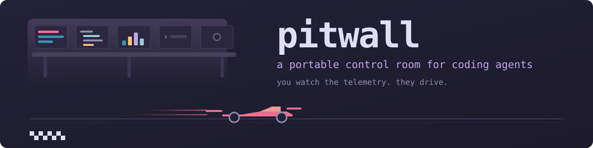

<div align="center">



<p>


</p>

</div>

# 🏎️ pitwall

A portable, self-contained terminal control room for coding agents on Windows.

One folder. You run one script and get a terminal with an agent sidebar on the
left, your agent in the middle, and a git-aware file viewer on the right that
shows the diff of whatever the agent just touched, and opens an editor on it
when you want to fix something yourself.

It installs nothing into your system terminal and nothing into your normal
Claude Code setup. Delete the folder and it is gone.

```
+------------------+--------------------------------+---------------------------+
|  spaces          |                                |  tree            diff     |
|   * pitwall      |   claude / codex / any agent   |   > src/         @@ -1,4  |
|                  |                                |   M app.ts       - old    |
|  agents          |                                |   A util.ts      + new    |
|   * claude  idle |                                |                           |
+------------------+--------------------------------+---------------------------+
   herdr sidebar          your agent                    herdr-file-viewer
```

## 🏁 Why "pitwall"

In Formula 1 the pit wall is the row of screens where the team watches every
car's telemetry and makes the calls, while the drivers drive.

That is the whole idea here. The agents drive. You sit at the wall, watch what
they are doing, read the diffs as they land, and decide. The name is the job
description.

## Why this exists

Two reasons, and the second is the one that shaped the design.

1. **Seeing the work.** An agent writing code is only useful if reviewing it is
   fast. A permanent right-hand panel that jumps between changed files turns
   review from a context switch into a glance.

2. **Keeping it separate.** Not every project is one where you want a
   customised terminal on screen. This bundle never becomes your default
   terminal, never registers a context menu entry, and never edits the
   Windows Terminal you already have. You keep the stock terminal for shared
   screens and client work, and launch this one when you want it.

## What you need

| Requirement | Notes |
|---|---|
| Windows 10 2004 or newer | Portable mode needs it. Windows 11 is fine |
| x64 | The manifest pins x64 builds. Edit `bootstrap.ps1` for arm64 |
| PowerShell 7 | Optional but recommended. `winget install Microsoft.PowerShell` |
| Visual C++ 2015+ runtime | Usually already present. `winget install Microsoft.VCRedist.2015+.x64` |
| An agent CLI | Claude Code, Codex, opencode, whatever you already use |
| No admin rights | Nothing here needs elevation |

About 195 MB of downloads, roughly 115 MB on disk once built.

## Install

```powershell
git clone <this-repo> pitwall
cd pitwall
powershell -ExecutionPolicy Bypass -File .\bootstrap.ps1
```

Then install the file viewer once, and verify:

```powershell
.\bin\herdr.exe plugin install smarzban/herdr-file-viewer --yes
powershell -ExecutionPolicy Bypass -File .\Test-Bundle.ps1
```

`Test-Bundle.ps1` runs 43 checks across three passes: files and configuration, a
live herdr session it starts and tears down, and a confirmation that nothing
outside this folder was touched. Every failure prints what was expected, what was
found, and how to fix it. If you need to ask someone for help, paste its whole
output.

## Use

```powershell
.\Start-Pitwall.ps1
```

Two modes:

| Command | Claude Code reads | herdr session | Use it for |
|---|---|---|---|
| `.\Start-Pitwall.ps1` | your normal `~/.claude`: your plugins, your CLAUDE.md, your login | `default` | your own projects |
| `.\Start-Pitwall.ps1 -Clean` | `.\config\claude`: no personal plugins, no personal CLAUDE.md, its own login | `clean` | client work, shared screens |

`-WorkDir <path>` opens somewhere other than the parent folder.

The two modes get **separate herdr sessions on purpose**. herdr's server is
persistent and the panes it spawns inherit the environment the server started
with, so a clean client attaching to a personal server would have produced panes
with no isolation at all while still reporting "clean". Separate sessions make
that impossible.

Each mode is also a Windows Terminal profile, so `ctrl+shift+t` inside a running
window lets you open the other one in a new tab.

Full manual, including every setting you can change and how:
**[docs/USAGE.md](docs/USAGE.md)**.

### Keys

The prefix is `ctrl+b`. Press `ctrl+b ?` for the full list.

| Key | Action |
|---|---|
| `ctrl+b f` | File viewer in a split. This is the right-hand panel |
| `ctrl+b shift+f` | File viewer in its own tab |
| `ctrl+b alt+g` | lazygit in a popup |
| `ctrl+b c` | New tab |
| `ctrl+b v` / `ctrl+b -` | Split right / split down |
| `ctrl+b h j k l` | Move between panes |
| `ctrl+b z` | Zoom the focused pane |
| `ctrl+b w` | Workspace switcher |
| `ctrl+b b` | Toggle the sidebar |

Inside the file viewer:

| Key | Action |
|---|---|
| `]` / `[` | Next / previous changed file |
| `v` | Cycle diff, rendered markdown, syntax highlighted |
| `b` | Toggle diff baseline between merge-base and HEAD |
| `f` | Fuzzy find |
| `p` | Pin a file and keep browsing |
| `a` / `A` | Annotate a range to hand to the agent |
| `L` | Copy a `path:line` reference |
| `e` | Edit it. micro opens in the same pane; the viewer returns when you quit |
| `?` | Help |

## What it touches outside its own folder

Two things. Both are per user, neither needs admin, and `Uninstall.ps1` reverses
both.

| What | Where | Why it cannot live in the folder |
|---|---|---|
| JetBrainsMono Nerd Font | `%LOCALAPPDATA%\Microsoft\Windows\Fonts` and `HKCU\...\Fonts` | Windows Terminal loads fonts by name from the font registry, not from a path |
| herdr state | `%APPDATA%\herdr` (plugins, logs, socket, session) | herdr offers no environment variable to relocate it. `HERDR_CONFIG_PATH` moves `config.toml` and nothing else |

Explicitly **not** touched:

- Your installed Windows Terminal, stable or preview. This bundle ships its own
  copy in portable mode, which Microsoft documents as not interfering with other
  installed distributions.
- Your `~/.claude`, unless you asked for `-Clean`, in which case it is not read
  at all.
- Your `PATH`, your registry beyond the font, and your default terminal setting.

```powershell
.\Uninstall.ps1                                     # font only
.\Uninstall.ps1 -RemoveHerdrData -RemoveBinaries    # everything
```

## What is inside

| Component | Version | Role |
|---|---|---|
| [herdr](https://herdr.dev) | 0.8.2 | Agent-aware multiplexer. The sidebar, panes and agent state |
| [Windows Terminal](https://github.com/microsoft/terminal) | 1.25.1912.0 Preview | The window. Preview because the Kitty keyboard protocol landed in 1.25 and Shift+Enter depends on it |
| [herdr-file-viewer](https://github.com/smarzban/herdr-file-viewer) | 1.16.0 | The right-hand panel |
| [lazygit](https://github.com/jesseduffield/lazygit) | 0.64.1 | Fallback git panel |
| [delta](https://github.com/dandavison/delta) | 0.19.2 | Diff rendering |
| [bat](https://github.com/sharkdp/bat) | 0.26.1 | Syntax highlighting |
| [glow](https://github.com/charmbracelet/glow) | 3.0.0 | Markdown rendering |
| [micro](https://github.com/zyedidia/micro) | 2.0.15 | The editor `e` hands off to. 4 MB, no modes, mouse works |
| [JetBrainsMono Nerd Font](https://github.com/ryanoasis/nerd-fonts) | 3.5.1 | Icons in the sidebar |

The content pane's colours are not the stock ones. Against this bundle's
background, the comment colour of bat's default theme scores 3.19 for contrast
where 4.5 is the readable minimum, so both renderers are pinned to Catppuccin
Macchiato (5.62) through wrappers in `platform/windows/`. The reasoning, the
measurements and how to change it are in
[docs/USAGE.md](docs/USAGE.md#colours-and-theme).

## Layout

```
pitwall/
  bootstrap.ps1              build bin\ from the manifest
  Start-Pitwall.ps1     the launcher, personal and -Clean modes
  Test-Bundle.ps1            43 checks: static, live, and global footprint
  Uninstall.ps1              reverse the two global side effects
  config/                    cross platform: works as-is on macOS and Linux
    herdr/config.toml        theme, sidebar, keybindings, worktrees
    file-viewer/config.toml  which renderers and editor the viewer uses
    micro/                   editor settings and colourscheme
    claude/                  the -Clean profile lands here, gitignored
  platform/windows/
    wt-settings.json         Windows Terminal profiles, __BUNDLE__ token
    pane-init.ps1            what each pane runs, and where -Clean is applied
    agent-shell.cmd          pane shell that re-adds bin\ to PATH
    render-syntax.cmd        bat, themed for contrast
    render-diff.cmd          delta, themed for contrast
    edit.cmd                 micro, with its config kept inside the bundle
    Build-HerdrConfig.ps1    renders the __BUNDLE__ token at launch
  docs/USAGE.md              the user manual: every key, every setting
  docs/PLAN.md               the research behind every choice
  bin/                       gitignored, rebuilt by bootstrap.ps1
```

`config/` is deliberately separate from `platform/`. A macOS port replaces
`platform/windows/` and reuses `config/` unchanged, apart from two action ids
noted below.

## Does this work on macOS?

Partly, and the split is clean.

| Layer | macOS | Notes |
|---|---|---|
| herdr | Yes, better than on Windows | `brew install herdr`. macOS is its primary platform |
| herdr-file-viewer | Yes | The non-suffixed actions are the macOS ones |
| lazygit, delta, bat, glow | Yes | All in Homebrew |
| `config/herdr/config.toml` | Almost | Drop the `-windows` suffix from the two file viewer action ids, and change the `worktrees` path |
| Nerd Font | Yes | `brew install --cask font-jetbrains-mono-nerd-font` |
| Windows Terminal portable | **No** | Windows only. Use WezTerm, Ghostty, iTerm2 or Alacritty |
| The three `.ps1` scripts | **No** | They need shell equivalents |

So the agent layer and the review layer port cleanly. The window and the
scripts do not. A macOS port is a new `platform/macos/` folder with a shell
launcher and a Brewfile, not a rewrite.

## Known issues

Open upstream, current as of 2026-08-23:

| Issue | Effect here |
|---|---|
| [herdr#2692](https://github.com/herdrdev/herdr/issues/2692) | Sidebar labels can be near-invisible on dark themes. Worked around in `config.toml` under `[theme.custom]` |
| [herdr#3129](https://github.com/herdrdev/herdr/issues/3129) | The 0.8.2 archive needs `VCRUNTIME140.dll`. `bootstrap.ps1` checks for it and tells you how to install it |
| [herdr#1054](https://github.com/herdrdev/herdr/issues/1054) | Shell config can be ignored, opening PowerShell 5.1 in panes |
| [herdr#3024](https://github.com/herdrdev/herdr/issues/3024) | Plugin pane paths on Windows. Not observed here, but `ctrl+b alt+g` is the fallback if the viewer ever fails to open |

Windows support in herdr became generally available in 0.8.2 on 2026-08-19.
It is young. Expect rougher edges than on macOS.

## Troubleshooting

Run `.\Test-Bundle.ps1` first. It names the problem and the fix for most of them.
[docs/USAGE.md](docs/USAGE.md#when-something-breaks) has the full table.

A pane opens at a bare prompt instead of the console: read `bin\pane-init.log`.
It records the bundle root, whether `herdr.exe`, `conpty\conpty.dll` and the
config were found, and which mode and herdr session the pane resolved to.

The file viewer says a renderer is missing: `bin\` is not on the pane's PATH.
herdr rebuilds PATH for the panes it spawns, which is why the pane shell is
`platform\windowsgent-shell.cmd` rather than `pwsh` directly. Check that
`default_shell` in `bin\herdr-config.toml` points at that wrapper, and re-run
`bootstrap.ps1 -Force` if the rendered config looks stale.

Icons render as empty boxes: the font did not install. Re-run
`bootstrap.ps1 -Force` and check the count it reports.

herdr starts and exits instantly: `conpty\` is missing next to `herdr.exe`.
herdr ships its own ConPTY runtime and will not run without it. Run
`bootstrap.ps1 -Force`.

## Project status

**This is a personal project, published because it may as well be useful to
someone.** It is not a product, there is no company behind it, and I make no
money from it. It is open because there is no reason for it not to be.

What that means in practice, so nobody's expectations get bruised:

- **It is built for how I work.** Decisions get made on what I need, and the
  code stays the shape I want it. If something here does not suit your setup,
  that is not a bug, and forking is genuinely the right answer.
- **No roadmap, no release cadence, no support promise.** It gets attention
  when I am using it and it annoys me, which is often, but not on a schedule.
- **Issues are welcome and I do read them.** A bug report, a Windows quirk I
  have not hit, a thing that is broken on your machine: all worth opening. Just
  do not expect a triage SLA.
- **Help is welcome when it is genuinely useful.** If you have a fix or an idea
  that clearly makes the thing better, open a PR and I will look at it properly.
  I would rather say a friendly no to something that pulls the project sideways
  than merge it and resent it later.

Take it, fork it, strip it for parts. That is what it is here for.

## Licence

The scripts and configuration here are MIT. Every bundled tool keeps its own
licence; herdr is Apache 2.0.

## Credits

The workflow this imitates is [Kun Chen's](https://github.com/kunchenguid/dotfiles)
agentic engineering setup. His runs on macOS with WezTerm, Neovim and Neogit.
This is the Windows reading of the same idea, with the editor swapped for a
read-only file viewer.
